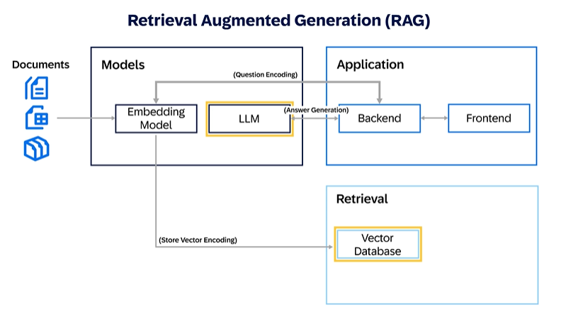

# Applying Retrieval Augmented Generation (RAG) and Fine-Tuning Strategies to Improve LLM Performance

---

## 1. Retrieval Augmented Generation (RAG)

---

### 1.1 Introduction to RAG

**Retrieval Augmented Generation (RAG)** is an advanced technique that combines the power of Large Language Models (LLMs) with an external knowledge retrieval system.

Instead of relying solely on what the model has memorized during training, RAG allows the model to **fetch fresh, domain-specific information** from an external source (such as a vector database or a document repository) at query time.

---

### 1.2 How RAG Works

- The user submits a prompt to the system.
- The message is encodeded into a dense factor by the embedding model.
- The system **retrieves relevant documents** or knowledge snippets from an external data source.
- The retrieved information is **passed into the LLM** along with the user’s query.
- The LLM **uses both** the retrieved data and its own language understanding to generate a high-quality, contextually accurate response.

---

### 1.3 Why RAG is Important

- **Bridges knowledge gaps**: LLMs no longer depend only on static, pretrained information.
- **Improves accuracy**: Ensures outputs are aligned with up-to-date, verified external knowledge.
- **Enhances domain adaptation**: Useful for industries with very specific language or rapidly changing information (finance, legal, healthcare, etc.).
- **Minimizes hallucination**: Reduces the risk of the model fabricating incorrect information.

---

### 1.4 Relevant Info:

- The new process is **called Grounding**

- There is anew Emdedding Model before LLM which communicate with other Applications retriving Vector Database

---

### 1.5 Summary

- **RAG = LLM + external retrieval system.**
- RAG improves LLM responses by injecting fresh, targeted information dynamically at inference time.
- It is a key strategy to make LLMs more **reliable, relevant, and domain-adapted** without fully retraining the model.

---

## 2. SAP Hana Vector Engine

---

### 2.1 Role

- SAP Hana vector engine is a component of SAP Hana database designed to handle complex and unstructured vector data.

- SAP Hana Vector Engine is optimized for executing vectorized operations on large datasets, allowing for efficient parallel processing.

- Here are some key benefits of using an SAP HANA vector engine.
  - Performance: It provides a high-performance vector store that can handle large volumes of data, which is crucial for AI applications.
  - AI Integration: The Vector Engine facilitates the integration of AI models, like those used in RAG, with enterprise-grade databases for enhanced query responses.
  - Scalability: It supports the development of scalable AI applications that can grow with the needs of the business.
  - Data Analysis: The engine allows for the seamless processing, comparison, and utilization of vector data, which is vital for building intelligent data applications.
  - Contextual Understanding: By storing and analyzing vector embeddings, the Vector Engine adds more context to generative AI scenarios, improving the relevance and accuracy of the AI’s output.
  - Frameworks Integration: With the integration of frameworks like LangChain, it becomes easier to build chat-based applications that can answer technical questions or provide information spread across many pages of a website.

---

## 3. Fine - Tuning Large Language Models

---

## 6.3 Fine-Tuning Large Language Models

---

### 3.1 What is Fine-Tuning of LLMs

- **Fine-tuning** refers to the process of **adjusting a pretrained model’s parameters** or, in some cases, its architecture, to **optimize performance on a specific task or domain**.

- It involves **training the model on task-specific datasets** that contain examples tailored to the intended use case.

- Fine-tuning allows the model to:
  - **Adapt to specialized vocabulary** or context.
  - **Refine behavior and output style** based on business needs.

- **Important considerations**:
  - Fine-tuning is a **resource-intensive process**:
    - Requires labeled and curated training data.
    - Demands significant computational resources (GPUs, TPUs).
    - Needs expertise in deep learning and LLM behavior.

- **Fine-tuning is not always necessary**:  
  Often, Retrieval-Augmented Generation (RAG) or Prompt Engineering can be more cost-effective alternatives for small adaptations. *For example introducing new knowledge to a model is not the ideal usecase for fine-tuning*.

---

### 3.2 Use Cases for Fine-Tuning

- **Enhancing existing knowledge**:  
  Reinforce domain-specific concepts that the base model might only partially understand.

- **Customizing model behavior**:  
  Adjust how the model responds to different inputs, such as changing tone, style, or decision patterns.

- **Controlling model outputs**:  
  Guide the model to produce more aligned, structured, or business-appropriate outputs.

- **Sanitizing responses**:  
  Fine-tune the model to **eliminate harmful, biased, or inappropriate content** from its outputs, ensuring compliance with ethical and regulatory standards.

---

### 3.3 Important Notes for Certification

- Fine-tuning is suitable for **high-impact, domain-specific tasks** where **prompting or retrieval is not enough**.
- It requires **careful evaluation** to balance **cost**, **training complexity**, and **model governance**.
- SAP encourages considering lighter methods like **Prompt Engineering** or **RAG** **before opting for fine-tuning**, unless **deep customization** is required.

---

## Summary

- Fine-tuning adjusts LLMs to better fit specialized tasks but comes with high costs and complexity.
- It is a powerful strategy when **domain-specific adaptation** is critical, but it should be applied carefully and justified against simpler optimization techniques.

---

## 4 Optimizing LLM Performance Using Agents

---

### 4.1 Agents, Functions, and Tools for Optimizing LLM Performance

To improve the quality and relevance of LLM responses, techniques like **Prompt Engineering**, **Retrieval-Augmented Generation (RAG)**, and **Fine-Tuning** are critical.

Additionally, **pairing LLMs with agents, functions, and tools** can significantly extend their capabilities and improve their performance in real-world applications.

---

#### Agents

- **Agents** are software programs that act as **intermediaries** between users and LLMs.
- Responsibilities of agents include:
  - Handling user input.
  - Translating user instructions into structured prompts for the LLM.
  - Interpreting the LLM’s outputs back into understandable formats for the user.
- Advanced agents can **dynamically identify** the appropriate **functions** or **tools** to call based on the user's intent, **enabling complex task execution** without hardcoding all possible interactions.
- **Maturity of the agent framework** determines how autonomously and efficiently the system can adapt to various scenarios.

---

#### Functions

- **Functions** are small, specialized units of code that **extend the LLM’s abilities** by:
  - Connecting to external data sources (APIs, databases).
  - Performing calculations or transformations that the LLM alone cannot.
- Example:
  - An LLM used for **code generation** could call a function that **queries a code repository** for best practices or reusable snippets, enhancing the generated outputs.

---

#### Tools

- **Tools** are external software programs that **support interaction** with LLMs.
- Tools can be:
  - Text editors for creating and refining prompts.
  - Debugging tools to inspect and validate LLM outputs.
  - IDE integrations (e.g., **Copilot inside VSCode** for code generation and validation).
- The choice of tools depends heavily on the user's objectives and the task complexity.

---

### 4.2 Scenario: Agent, Function, and Tool Interaction

**Business Scenario**:

A marketing analyst needs to generate a quarterly marketing report.

Workflow:

1. **Agent**:
   - Interacts with the user to clarify the report’s content, structure, and requirements.
   - Translates the user’s natural language input into a structured prompt for the LLM.

2. **Function**:
   - Connects to the company's **data warehouse**.
   - Retrieves the latest sales, engagement, and customer acquisition data needed for the report.

3. **LLM**:
   - Consumes both the **structured prompt** and **retrieved data**.
   - Generates a complete marketing report, formatted according to company standards.

4. **Tools**:
   - The analyst uses a **text editor** to fine-tune the generated content.
   - A **validation tool** checks for compliance and accuracy before final submission.

---

## Summary

- **Agents orchestrate interactions** between users, LLMs, and external systems.
- **Functions extend LLM capabilities** by enabling access to dynamic or external data sources.
- **Tools support the user** in creating, refining, and validating LLM outputs.
- Together, they enable **more intelligent, flexible, and scalable** LLM-powered solutions in business environments.

---
