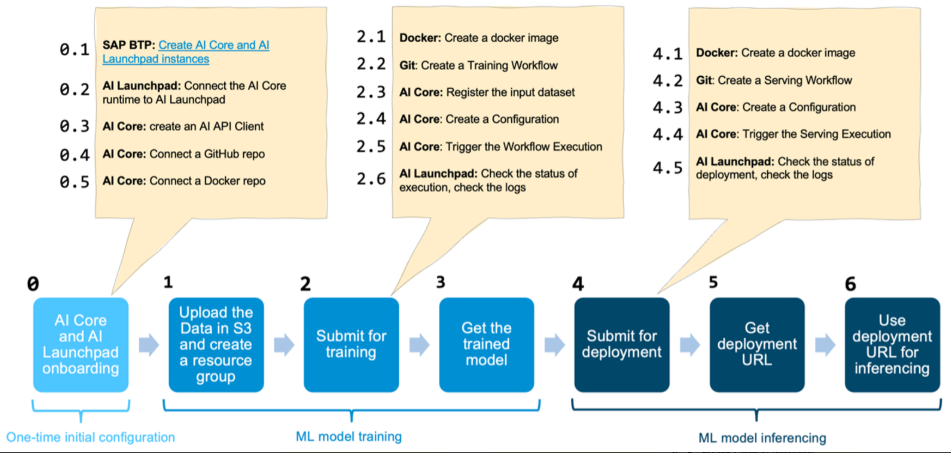

# Configuring SAP AI Core and SAP AI Launchpad

- With SAP AI Core, customers gain peace of mind as they benefit from a complete service that package all dependencies and hides the complexity of buulding own training and serving productive environments.

- SAP AI Core exposes simple API endpoints to embed AI into your business applications.

- SAP AI Core and SAP AI Launchpad offer enterprise-grade features to productize and operate your AI models. The main capabilities that SAP AI Core provides are the orchestration of AI workflows, such as model trainings and batch inference, as well as serving model inference, so that models can make predictions.

- To ease the shipment of new AI scenarios, the service offers continuous delivery capabilities and ensures tenant isolation with multi-tenancy.

- During development your AI scenarios, you are supported with development tooling, such as the SAP AI Core SDK, and full flexibility in the choice of storage for your data and models.

## Building new SAP AI Core

1. Initial Configuration

2. Model Training

3. Inferencing

- Below is the end-to-end ML Workflow in SAP AI Core which shows the various sub-steps in each of these steps.

## Skeleton of Building AI in SAP

---

This section explains the **end-to-end structure** (skeleton) of how you build, train, deploy, and use an AI model in **SAP AI Core** until it becomes an **API-enabled AI service** that can be used inside business applications.

---

### Step 1: Initial Configuration

- You define your **AI scenario**.
- Set up your **SAP AI Core instance** with:
  - Access to your data sources (e.g., S3, Blob Storage).
  - Environment configuration (e.g., Docker images with your training code).
  - Connection to **SAP AI Launchpad** for monitoring and control.

📌 Think of this as preparing your lab: where the data is, what model you want, and how it should run.

---

### Step 2: Model Training

- You trigger a **training job** using the orchestration engine of SAP AI Core.
- The training logic runs inside a **Docker container**, either:
  - Custom-written (your code), or
  - Prebuilt (standard image).
- Model artifacts (e.g., `.h5`, `.onnx`) are stored in the configured storage location.

📌 This is where the machine learning model learns from your data.

---

### Step 3: Inference (Serving the Model)

- Once trained, the model is **deployed as an inference service**.
- SAP AI Core creates an **endpoint** (HTTP API) that allows external systems (like SAP S/4HANA or custom apps) to send new data and receive predictions.
- You can scale this deployment and integrate it securely into SAP BTP.

📌 At this stage, your model becomes a **live AI service** — ready to make real-time or batch predictions.

---

### Extra Features Provided

- **Multi-tenancy** → Isolates data and models for each customer or use case.
- **CI/CD pipelines** → Automate retraining and redeployment of models.
- **Monitoring via SAP AI Launchpad** → See job status, errors, logs, etc.
- **SDKs and APIs** → Develop locally and push to cloud easily.

---

### Final Outcome

> You now have a **production-grade AI service** that exposes a **REST API**.  
> This API can be called from any SAP or non-SAP system to make intelligent decisions based on your trained model.

---

## SAP AI Launchpad

- SAP AI Launchpad is a service on SAP Business Technology Platform (SAP BTP) to transparently manage AI models across the enterprise.

- The application acts as the single access point for all AI content across your SAP landscape. From an MLOps perspective, SAP AI Launchpad provides customers with the capabilities to capture and analyze metrics that has been created by supported AI runtimes - for example, SAP AI Core.

### AI API

- Integration between SAP AI Launchpad and supported AI runtimes in order to collect data for MLOps perspective.

### Added value of SAP AI Launchpad

1. Centralized AI Lifecycle Management
    - Customers connect to all AI API-enabled services and streamline the AI lifecycle management

2. Monitor and continously improve model performance
    - Customers benefit from simplified model retraining to continously imporve their model performance.

## AI Core Configuration

---

### What is SAP AI Core?

**SAP AI Core** is the **runtime and orchestration engine** responsible for:

- Executing **machine learning (ML) pipelines**.
- Deploying **trained AI models** into production.
- Exposing those models as **REST API endpoints** for business consumption.

SAP AI Core handles infrastructure-level complexity, offering **enterprise-grade scalability, automation, and monitoring**.

---

### Containers in SAP AI Core

SAP AI Core uses **containers** to package and execute code reliably across environments.

- A **container** is a lightweight, standalone executable unit that includes:
  - Code
  - Runtime
  - Libraries and dependencies

- **Docker** is the containerization tool used by SAP.
- Every training, batch inference, or deployment job runs **inside its own container**.

📦 This ensures that your AI model behaves consistently across dev, test, and prod environments.

---

### Kubernetes: The Core Infrastructure Layer

- **SAP AI Core runs on Kubernetes (K8s)** — a powerful system for managing containerized workloads at scale.
- Kubernetes automatically:
  - Allocates resources
  - Restarts failed jobs
  - Scales up/down based on load

✅ Behind the scenes, **every model training and serving job is a Kubernetes workload** orchestrated by SAP AI Core.

---

### Cloud-Native Architecture with Microservices

SAP AI Core promotes a **cloud-native architecture** by:

- Splitting applications into **microservices** (instead of monolithic apps).
- Running each microservice in its own container.
- Ensuring:
  - Easier updates and deployments
  - Better fault isolation
  - Scalability by demand

Example: You can deploy the training process as one service, the model inference as another, and reuse both independently.

---

### Declarative Configuration & Pipeline Templates

SAP AI Core uses **YAML-based configuration files** to declare:

- The desired infrastructure state (e.g., GPU-enabled training)
- Pipeline steps (e.g., preprocess → train → deploy)
- Parameters, artifacts, and resource allocation

SAP provides **ready-to-use template files** to help define:

- Environments
- CI/CD flows
- Training & serving pipelines

---

### CI/CD in SAP AI Core with GitHub + Argo Workflows

- **CI/CD** = Continuous Integration / Continuous Delivery for AI pipelines.
- SAP uses:
  - **GitHub** as version control and trigger mechanism.
  - **Argo Workflows** (on Kubernetes) for orchestrating **parallel AI jobs**.

Example:
> A change pushed to a pipeline definition in GitHub triggers an **Argo workflow** to retrain a model and redeploy it via SAP AI Core.

---

### Serving with KServe

- **KServe** is the model serving component used by SAP AI Core.
- It allows trained models to be **served as live REST APIs** with:
  - Auto-scaling
  - Health checks
  - Logging and monitoring

KServe integrates tightly with Kubernetes and supports **multiple ML frameworks** (TensorFlow, PyTorch, XGBoost, etc.).

---

### Summary

| Component      | Role in SAP AI Core                                              |
|----------------|------------------------------------------------------------------|
| **Docker**     | Containerizes model code and dependencies                        |
| **Kubernetes** | Manages and orchestrates all container workloads                 |
| **Argo**       | Executes CI/CD workflows and ML pipelines                        |
| **KServe**     | Serves trained models as scalable REST APIs                      |
| **GitHub**     | Triggers deployments via commits and pull requests               |

---

SAP AI Core enables you to move from training → deployment → serving, all automated, **securely and scalably**. You focus on your AI logic; SAP takes care of everything else behind the scenes.

---

## ML Workloads and Resource Isolation in SAP AI Core

---

SAP AI Core is a **multi-tenant platform** designed to safely run machine learning workloads across different users and organizations. To ensure **security, data isolation, and workload management**, it uses the concept of **Resource Groups**.

---

### 🔐 What Are Resource Groups?

- A **Resource Group** is a logical container used to **isolate machine learning workloads** (such as model training, inference, data artifacts, pipelines).
- Resource Groups are mapped to **namespaces in the underlying Kubernetes cluster**.
- Each Resource Group ensures:
  - Separation of data and AI assets.
  - Controlled access and authorization.
  - Flexible organization of workloads by **customer** or **department**.

---

### 🧩 Multi-Tenancy via SAP BTP Tenant Model

SAP AI Core is deployed inside **SAP Business Technology Platform (BTP)**, which supports multi-tenant architecture.

There are **two common ML workload scenarios** for managing tenants and resource groups:

---

### 1. Embedded AI Offered by SAP Lines of Business (LoB)

- **Use Case**: SAP offers pre-packaged, embedded AI features to multiple customers.
- **Structure**:
  - The SAP Line of Business (LoB) owns and manages **a single SAP BTP tenant**.
  - Each **customer is treated as a "subtenant"** within that tenant.
- **Security**:
  - Each subtenant (customer) is assigned its own **Resource Group** in AI Core.
  - This ensures complete isolation of:
    - Training jobs
    - Deployed models
    - ML pipelines and data artifacts
- ✅ Enables SAP to scale embedded AI across customers while maintaining **strict data isolation**.

---

### 2. Direct Use by Individual Customers

- **Use Case**: A company uses **SAP AI Core directly** to build and operate its own ML scenarios.
- **Structure**:
  - The company owns its own **SAP BTP tenant**.
  - Internally, it can use multiple **Resource Groups** to manage projects or departments (e.g., Finance, Marketing, R&D).
- **Benefits**:
  - Full control and governance over the tenant.
  - Clean separation of AI assets and data within the same organization.
- ✅ Ensures secure usage while promoting reuse, governance, and scalability inside the company.

---

### 🧠 Summary

| Scenario                           | BTP Tenant Owner     | Resource Group Purpose                                 |
|-----------------------------------|----------------------|--------------------------------------------------------|
| Embedded AI by SAP (LoB)          | SAP Line of Business | One per customer (subtenant) to isolate their assets   |
| Direct Customer Usage             | Customer Company     | One per department/project within the customer org     |

---

In both models, **Resource Groups are the foundation for secure ML workload isolation** in SAP AI Core.  
They ensure that data, models, and pipelines are never shared unless explicitly authorized — making AI deployment safe and scalable across enterprise environments.

---
