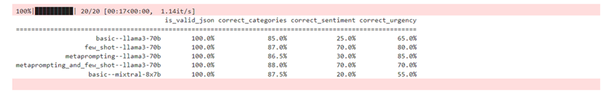

# Selecting the Suitable LLM

1. mistralai--mixtral-8x7b-instruct-v01

We begin with mistralai--mixtral-8x7b-instruct-v01 and use the basic prompt. This model is an example of the cheapest open source, SAP hosted models available on generative AI hub.

```python
overall_result["basic--mixtral-8x7b"] = evalulation_full_dataset(test_set_small, f_8, _model='mistralai--mixtral-8x7b-instruct-v01')
pretty_print_table(overall_result) 
```

- This code evaluates a dataset and prints the results. It calculates a specific model's performance on a small test set, storing the results under a key in the "overall_result" dictionary. The "pretty_print_table" function then formats and prints these results, making the evaluation data clear and easy to read.



- Similarly, let's evaluate results using a combination of few-shot and metaprompting for the same model.

```python
overall_result["metaprompting_and_few_shot--mixtral-8x7b"] = evalulation_full_dataset(test_set_small, f_13, _model='mistralai--mixtral-8x7b-instruct-v01')
pretty_print_table(overall_result) 
```

2. gpt-4o

We perform similar steps with gpt-4o. This model is an example of the best proprietary OpenAI models available on generative AI hub.

```python
overall_result["basic--gpt4o"] = evalulation_full_dataset(test_set_small, f_8, _model='gpt-4o')
pretty_print_table(overall_result)
```

3. gemini-1.5-flash

- We perform similar steps with gemini-1.5-flash. This model is the cheapest and fastest Google model available on generative AI hub.

```python
overall_result["basic--gemini-1.5-flash"] = evalulation_full_dataset(test_set_small, f_8, _model='gemini-1.5-flash')
pretty_print_table(overall_result)
```
