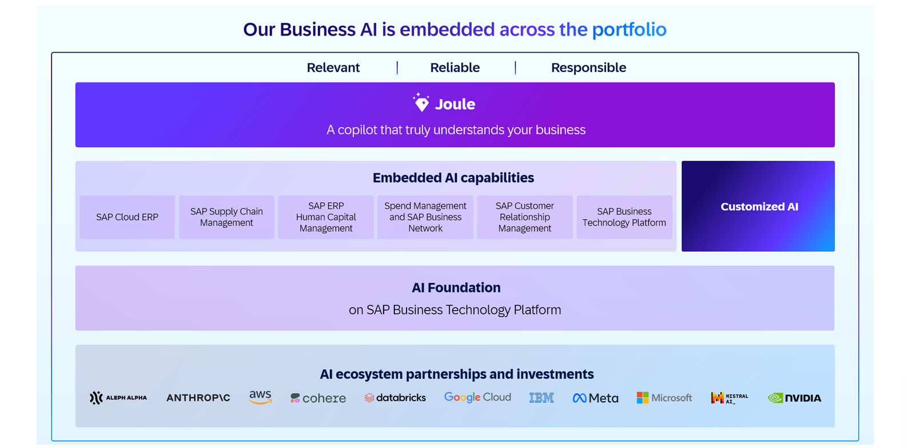

# Exploring Generative AI Hub

## AI Foundation on SAP BTP

- SAP AI Foundation provides the platform to infuse Business AI across applications and processes

- SAP uses this foundation ot buid their own applications and also offers it to customers and partners to bootstrap their own customized solutions

- **AI Foundation:** is a comprehensive set of services and tools for AI developers. Use Cases: develop, deploy and manage powerful custom-built *AI applications and AI extensions on SAP BTP*



The AI Foundation on SAP BTP has 3 layers:

1. AI Services -> provide ready to use AI Services (Document Intelligence). Good for Tabular Data Processing, Text Processing

- Infuse AI into Business Process outside of the box

2. AI Lifecycle Management

- AI Lifecycle Efforts end-to-end

- Enable customers develop, develop and manage AI apps and extensions

- All data in SAP environment

- Offers tools for centralized orchestation of AI

- Generative AI Hub (part of this layer) provides self-contained environment to experiment promt engineering and model descovery

3. Business Data & Context

- Contextualize business data to make AI relevant

- SAP HANA Cloud Vetor Engine stores emdeddings of unstructured data used for semantic data retrivel

- Knowledge Graph provides contextulized and semnatically abstracted access to domain knowledge and data models across SAP (One more line here to traduce in simpler words)

## Generative AI Hub

- AI Hub facilitate systematic and tool-supported model selection tailored to diverse use cases

```txt
SAP Business Technology Platform (BTP)
            |
            |
            |
    |--------------|
    |              |
    |              |
  SAP AI         SAP AI
   Core         Launchpad
    |              |
    |              |
    ----------------
            |
            |
        SAP Generative
          AI Hub
```

- SAP AI Hubs offers: trusted LLM, foundation model access

- Using SAP AI Hub ground business and context data => AI efficency

## Generative AI Hub in SAP AI Core

- Main Hub for including generative AI into AI tasks in SAP AI Core & SAP AI Launchpad

### How generative AI hub in constructed within SAP AI Core

```txt
Trust        ->     Orchestation    ->   GenAI Model Access     ->    Serving / Inference Engine

Authentification    Content Moderation                                  Models built by SAP
/ Authorization     Anonymization                                       Third Party Models
                    Prompt Registry                                     Open Source Models
Multi - Tenancy     Grounding                                           Customer Provided Models
```

- Generative AI Hub in SAP AI Launchpad -> Playground, Prompt engineering & Management

## Generative AI Hub - Core Concepts

- Generative AI Hub *covers the AI lifecycle efforts end-to-end*

- Enables customers to **develop, deploy and manage** custom-built AI solutions

- Enables **access to AI models**, out-of-the-box selection of compute resources and orchestation modules

- Provides a **comprehensive toolset for building** of custom AI solutions and model exploration

- Software **deployment includes all the steps**, processes, and activities that are required to make a software system or update available to its intended users

- Offers **BYOM** -> Bring Your Own Model as well as allocation of compute resources, training and serving template workflows

- **Orchestration**: **AI orchestration refers to the process of coordinating and managing the deployment, integration, and interaction** of various AI components within a system or workflow. This includes orchestrating the execution of multiple AI models, managing data flow, and optimizing the utilization of computational resources.

- **Governance**: Implementing policies and procedures to manage the development, deployment, and operation of AI systems in compliance with regulatory and organizational standards.

## Vector Engine

- The Vector Engine in SAP Generative AI Hub is a specialized service that stores, indexes, and searches vector embeddings (numeric representations of data like text or images) efficiently.

- It enables semantic search and retrieval-augmented generation (RAG) by quickly finding the most relevant vectors for AI models.

## Deploy an AI Model

1. Provisioning SAP AI Core

2. Check for Foundation models Scenarios

3. Creating a deployment configuration

4. Deploy
