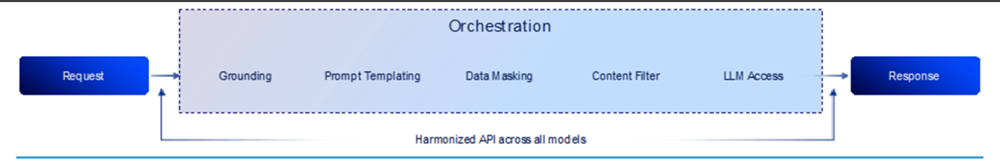

# Using generative-AI-hub-SDK to interact with Orchestration Services

## Need for Orchestration

- Business scenarios usually require more than the bare consumption of Foundation Models for generative tasks. They need to scale, secure, and manage these solutions.

